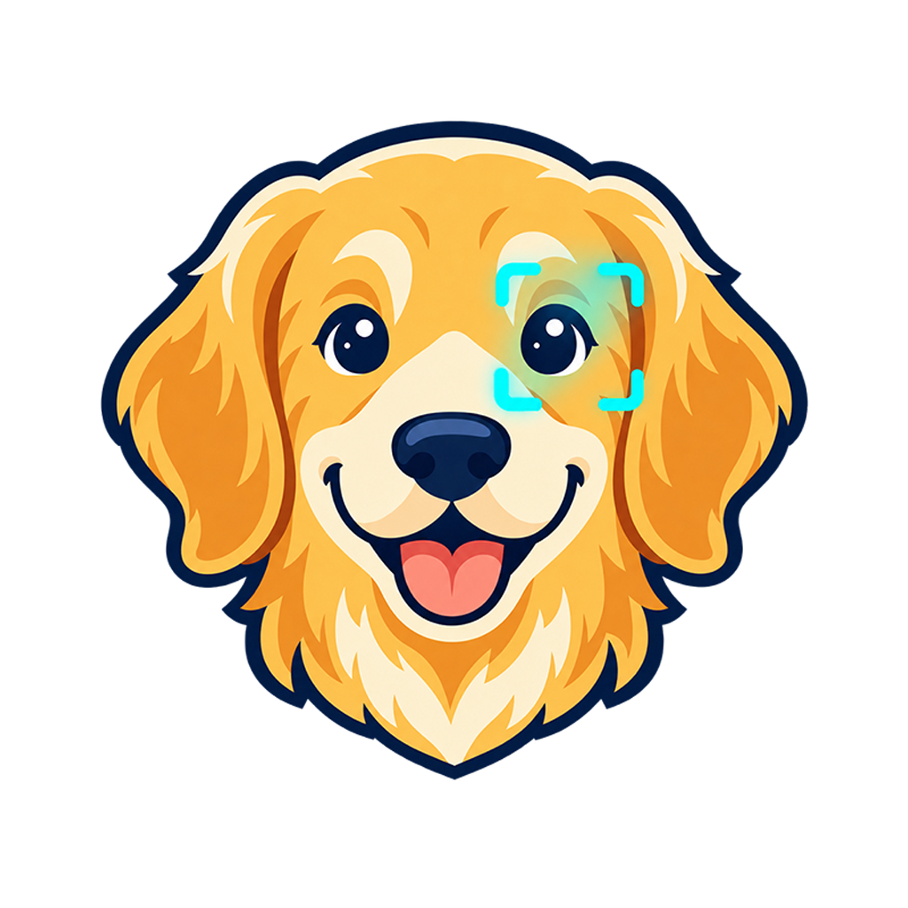
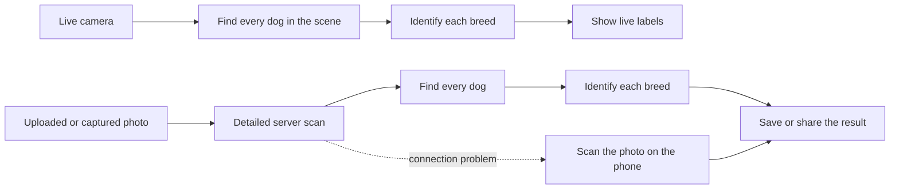

<div align="center">
  

  <h1>WanChan Beam</h1>

  <p><strong>Point. Scan. Meet the dog.</strong></p>
  <p>
    A mobile dog detector and 130-breed classifier built for live, on-device
    inference and shareable photo scans.
  </p>

  <p>
    
    
    <a href="LICENSE"></a>
  </p>
</div>

---

WanChan Beam combines computer vision, mobile development, and a hosted API in
one end-to-end project. Point the live camera at one or more dogs for private
on-device detection, or scan a saved photo through the more accurate server
pipeline with an automatic on-device fallback.

## Download

<p align="center">
  <a href="https://github.com/dinosoldic/wanchan-beam/releases/latest">
    
  </a>
</p>

Download the latest bundled Android app from
[GitHub Releases](https://github.com/dinosoldic/wanchan-beam/releases/latest).
The detector and breed classifier are included in the APK, so live scanning
works directly on the phone.

> [!IMPORTANT]
> Breed predictions are probabilistic visual estimates, not proof of ancestry.
> Mixed breeds, unusual poses, partial dogs, and poor lighting can all affect a
> result. Low-confidence predictions are deliberately shown as uncertain.

## Highlights

- Find multiple dogs through the live camera and recognize each from 130 different breeds.
- Scan uploaded photos or pictures taken inside the app.
- Scan live privately on your device and keep photo scanning available without an internet connection.
- Save finished scans or share them directly with another app.
- Use the camera in portrait or landscape.

## How it works



| Mode | What happens | Connection |
| --- | --- | --- |
| Live camera | Detection and breed recognition run on the phone | **Offline** |
| Photo scan | Uses the larger server models first, then falls back to the phone when needed | **Online & offline** |

The detector finds each dog first, then the classifier examines every detected
dog separately. That lets WanChan Beam label several dogs in the same scene
instead of treating the whole image as a single subject.

## Fine-tuning results

Fine-tuning made a measurable improvement over the trained head-only baseline
on the 5,200-image Tsinghua Dogs validation split:

| Model | Top-1 accuracy | Top-2 accuracy |
| --- | ---: | ---: |
| Baseline | 82.73% | 93.12% |
| Fine-tuned | **85.04%** | **93.83%** |
| Improvement | **+2.31 points** | **+0.71 points** |

Top-1 measures whether the first answer was correct; top-2 also counts a result
when the correct breed was the model's second choice. These figures use clean,
annotated validation images. Real camera scenes are harder, particularly with
occlusion, unusual poses, or very similar breeds. More detail is available in
the [breed-classifier report](ml/docs/Breed-classifier-report.pdf).

## Technology

| Area | Stack |
| --- | --- |
| Mobile | React Native, Expo, TypeScript |
| Camera | VisionCamera, frame processors, Worklets |
| On-device ML | LiteRT/TFLite |
| Backend | Node.js, Fastify, ONNX Runtime, Sharp |
| Machine learning | Python, PyTorch, Torchvision, Ultralytics |
| Deployment | Docker, Render, GitHub Actions |
| Models | YOLO26 and MobileNetV3-Large |

## Repository layout

```text
wanchan-beam/
├── mobile/          Expo/React Native application
├── server/          Hosted Fastify + ONNX inference API
├── ml/              Training, evaluation, export, and parity tooling
├── models/          Versioned on-device model package
└── LICENSE
```

## Run the mobile app

### Requirements

- Node.js 22 and npm
- Android Studio, Android SDK, and JDK 17 for Android
- A physical device or emulator

Expo Go is not supported because live camera inference relies on native
modules.

```bash
git clone https://github.com/dinosoldic/wanchan-beam.git
cd wanchan-beam/mobile
npm ci
```

Create and install the required Android development build:

```bash
npm run android
```

The pre-build hook copies the versioned LiteRT models and metadata into the
generated mobile asset directory automatically. On Windows, a short checkout
path is recommended because the native C++ toolchain can still encounter legacy
path-length limits.

## Run the inference server

```bash
cd server
npm ci
npm run build
npm start
```

The server listens on `PORT` when provided and otherwise uses port `3000`.

```text
GET  /health    Service health
POST /detect    Multipart image field named "image"
```

JPEG, PNG, and WebP images up to 10 MB are accepted by `/detect`.

## Data, models, and attribution

The breed classifier was trained using the
[Tsinghua Dogs dataset](https://cg.cs.tsinghua.edu.cn/ThuDogs/):

> Ding-Nan Zou, Song-Hai Zhang, Tai-Jiang Mu, and Ming Zhang,
> “A new dataset of dog breed images and a benchmark for fine-grained
> classification,” _Computational Visual Media_, 2020.
> [doi:10.1007/s41095-020-0184-6](https://doi.org/10.1007/s41095-020-0184-6)

Dog detection uses the nano and small variants from the YOLO26 family:

> Glenn Jocher, Jing Qiu, Mengyu Liu, Shuai Lyu, Fatih Cagatay Akyon, and
> Muhammet Esat Kalfaoglu, "Ultralytics YOLO26: Unified Real-Time End-to-End
> Vision Models," 2026.
> [doi:10.48550/arXiv.2606.03748](https://doi.org/10.48550/arXiv.2606.03748)

Breed classification is based on MobileNetV3-Large:

> Andrew Howard et al., "Searching for MobileNetV3," *Proceedings of the IEEE/CVF
> International Conference on Computer Vision*, 2019.
> [Paper](https://openaccess.thecvf.com/content_ICCV_2019/html/Howard_Searching_for_MobileNetV3_ICCV_2019_paper.html)

Dataset images are not redistributed in this repository. Download them from
the project website and follow the dataset authors' terms. Detector checkpoints
and derived artifacts use the
[Ultralytics YOLO26](https://docs.ultralytics.com/models/yolo26) ecosystem and
may remain subject to its upstream terms in addition to this repository's
license. Review all applicable terms before redistribution or commercial use.

## License

WanChan Beam source code is released under the
[GNU Affero General Public License v3.0 only](LICENSE).

This project is provided without warranty and is not a veterinary or genetic
testing service.
