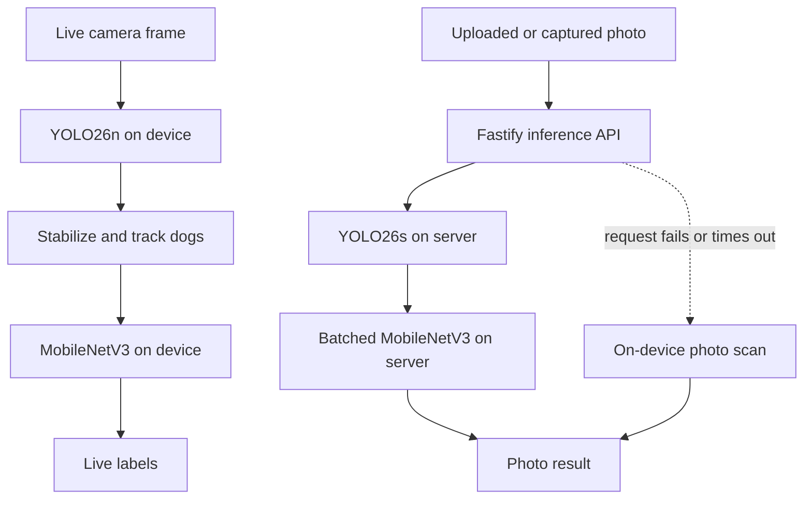

# Architecture

This document is the practical map of WanChan Beam. It explains where an image
goes, why the live and photo paths are different, and which files own the most
important decisions.

## System overview

WanChan Beam has two inference paths:



Live inference always stays on the device. Photo inference prefers the larger
server detector, but the same photo can still be processed locally when the
server is unavailable.

## Live camera path

The live path is designed around a limited phone inference budget. It samples
frames instead of trying to process every camera frame.

1. VisionCamera provides the physical camera frame and its orientation.
2. The native resizer rotates and letterboxes it into a planar RGB
   `1 x 3 x 544 x 544` tensor.
3. YOLO26n returns up to 300 end-to-end detections.
4. Dog rows are decoded, filtered at `0.15`, and checked for duplicate boxes.
5. Boxes are mapped from detector space to the oriented frame, then into the
   visible `cover` preview.
6. A lightweight IoU tracker smooths boxes and assigns a stable track ID.
7. Breed crops are classified one track at a time and cached by track ID.
8. Uncertain tracks can be retried after newer detector updates.

The detector accepts one pass every 300 ms. The classifier processes one breed
crop every 400 ms through its own queue, so several dogs do not block the camera
worklet at once.

The live overlay uses a direct label around the center of each dog in a quiet
scene. At four dogs it switches to edge callouts; it does not switch back until
only two remain. That gap prevents the layout from flickering when the count
moves around the boundary.

Main files:

- `mobile/app/camera.tsx` owns camera lifecycle, frame processing, and the
  classification queue.
- `mobile/features/inference/stabilizeLiveFrameDetections.ts` owns temporary
  track IDs and box smoothing.
- `mobile/features/inference/mapDetectorDetectionsToFrame.ts` and
  `mapFrameDetectionsToPreview.ts` own coordinate conversion.
- `mobile/features/camera/LiveBreedOverlay.tsx` owns the two live label layouts.

## Photo path

Both gallery uploads and photos captured inside the app call the same detection
service.

```text
photo -> server request -> server result
                     \-> any error or 5 s timeout -> bundled mobile models
```

The server path:

1. Fastify accepts one JPEG, PNG, or WebP file up to 10 MB.
2. Sharp decodes and auto-orients the image.
3. The image is letterboxed to `960 x 960` for YOLO26s.
4. Detector coordinates are mapped back to original image pixels.
5. Every dog box is cropped and letterboxed to `256 x 256`.
6. All crops are classified in one dynamic ONNX batch.
7. The API returns detector confidence, boxes, and the top two breed results.

The local fallback uses YOLO26n at `544 x 544`. It classifies the detected
dogs sequentially to keep device memory bounded when a photo contains many
dogs.

Main files:

- `mobile/services/DetectionService.ts` owns server-first selection and local
  fallback.
- `mobile/features/inference/detectDogsLocally.ts` owns the complete local photo
  pipeline.
- `server/src/api/detect.ts` owns request validation.
- `server/src/inference/detectDogs.ts` owns server inference orchestration.
- `server/src/inference/classifyDetectedDogs.ts` owns crop batching.

## Coordinate spaces

Most visual bugs in this project come from mixing coordinate spaces. These are
kept separate on purpose:

| Space | Meaning |
| --- | --- |
| Detector | Square letterboxed input used by YOLO |
| Physical frame | Raw camera buffer dimensions |
| Oriented frame | Frame after camera orientation is applied |
| Preview | Visible React Native camera area using `cover` |
| Original photo | Auto-oriented pixels returned in the API response |

`detectorBox` stays in `544 x 544` model space because the breed crop is taken
from that tensor. The visible `box` is mapped separately and must never be used
as a classifier crop without converting it back.

## Model assets

`models/v1` is the source of truth for the mobile model package:

- `mobile-detector.tflite`
- `mobile-breed-classifier.tflite`
- `labels.json`
- `preprocessing.json`
- `manifest.json`

`mobile/scripts/syncModelAssets.js` copies the runtime files into
`mobile/generated-assets/models`. That generated directory is ignored by Git
and exists only so Metro can bundle the assets.

The server keeps its deployable ONNX package in `server/models/v1`. This is an
intentional duplicate: Render uses `server` as its root directory, so the
service can build and start without depending on files outside that folder.

The manifests record shapes, class ordering, hashes, exporter versions, and
parity results. When a model changes, its artifact, preprocessing metadata,
labels, and hash must move together.

## Main design choices

### On-device live inference

Keeping live frames on the phone avoids continuous uploads, reduces latency,
and makes the camera useful offline. The smaller detector is the tradeoff that
makes this practical.

### Server-first photo inference

A still photo can wait longer than a live frame, so it uses the larger server
detector first. The bundled fallback prevents a sleeping or memory-limited free
server from making the feature unusable.

### Shared classifier architecture

The server and mobile app use exports of the same fine-tuned MobileNetV3
checkpoint. Matching labels and preprocessing are therefore part of the model,
not optional UI metadata.

### Simple tracking instead of identity recognition

Live tracks are matched by box overlap. This is enough to reuse predictions and
stabilize the overlay without adding another model, but a track may change when
dogs cross, disappear, or move quickly.
